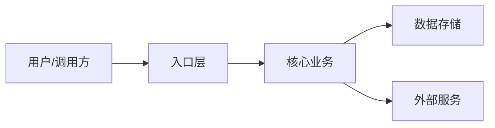

# Architecture

本文件记录当前项目的高层结构和关键模块关系。保持简短、可维护，避免复制源码细节。

## 系统概览

- 项目类型：
- 核心用户/调用方：
- 核心业务流程：
- 主要运行时：
- 外部系统：

## 架构图（可选）

当系统关系难以用文字快速说明时，维护一张简短 Mermaid 图。图只表达关键边界和调用方向，不追求完整细节。



## 目录结构

- `src/`：
- `app/`：
- `components/`：
- `lib/`：
- `server/`：
- `tests/`：
- `docs/`：
- 其他：

## 关键模块

### 模块名

- 路径：
- 职责：
- 主要输入：
- 主要输出：
- 关键依赖：
- 修改注意事项：

## 数据流 / 调用流

```text
入口 -> 服务/模块 -> 存储/外部服务 -> 返回
```

## 状态和数据模型

- 核心实体：
- 状态来源：
- 缓存策略：
- 持久化位置：
- 数据兼容要求：

## 外部依赖

- 服务/API：
- SDK：
- 数据库：
- 队列/缓存：
- 第三方认证/支付/通知：

## 架构边界

- 哪些模块可以调用哪些模块：
- 哪些依赖方向禁止：
- 哪些目录是生成代码：
- 哪些代码属于 legacy：

## 常见改动入口

- 修改 UI：
- 修改 API：
- 修改业务逻辑：
- 修改数据模型：
- 修改配置：
- 修改测试：

## 已知设计取舍

-
-

## 相关文档

- `docs/commands.md`
- `docs/testing.md`
- `docs/decisions/`
