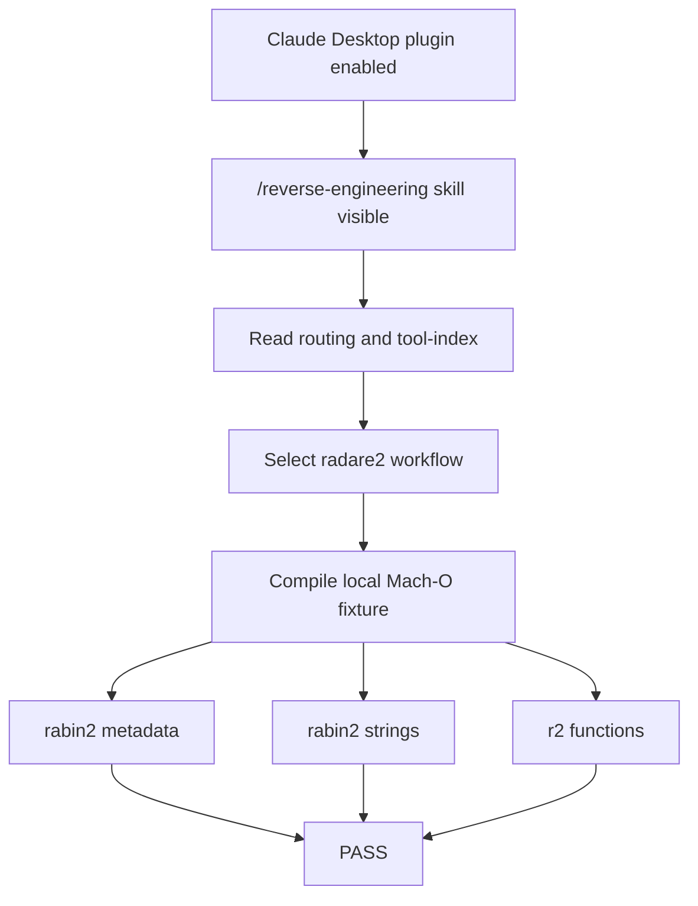

# 2026-06-15 Claude v3.2 plugin radare2 verification

## 场景分类

二进制分析 / Claude Desktop 插件验证 / radare2

## 目标概述

验证 `codex-workflow-kit` v3.2 在 Claude Desktop 的 LocalPlugins/CustomPlugins 层可见并启用，同时用本地良性 Mach-O 样本跑通 reverse-skill 的 `radare2` 静态分析路径。

## 完整执行链路

1. 在 Claude Desktop 插件详情页确认 `Codex Workflow Kit v3.2` 可见、启用，且技能卡片包含 `/workflow-kit-v32` 和 `/reverse-engineering`。
2. 回读 Claude 插件 manifest、marketplace、installed plugins、enabled settings，确认插件注册和启用状态。
3. 比对 Claude 插件 bundled asset 与 `/Users/junwei/Documents/codex-workflow-kit` 的 git-tracked 文件树 hash，568 个文件一致。
4. 读取 reverse-skill 的 `skills/routing.md`、`skills/tool-index.md`、`skills/radare2/SKILL.md` 和 field-journal 索引。
5. 按 routing 选择 `radare2` 子 skill：目标类型为 macOS Mach-O，本轮意图为二进制静态侦察。
6. 在 workspace 生成本地良性 C 样本 `claude_v32_reverse_case.c`，编译为 Mach-O 可执行文件。
7. 从 tool-index 读取并使用 `/Users/junwei/tools/radare2/rabin2` 与 `/Users/junwei/tools/radare2/r2`，不猜路径。
8. 运行 `rabin2 -I`、`rabin2 -zz`、`r2 -A -q -c "afl;izz;q"`，确认文件类型、字符串、函数均可恢复。
9. 生成用户侧 10-case 总报告与逆向案例报告。

## 关键结果

- Claude UI/注册层：插件可见、启用、13 个 v3.2 技能目录齐全。
- 包完整性：568 个 tracked assets 的 source hash 与 Claude bundled asset hash 一致。
- 逆向样本：`rabin2 -I` 识别为 `mach0` / `MACH064` / `arm` / `macos`。
- 字符串恢复：`workflow-kit-v32 reverse case accepted`、`workflow-kit-v32 reverse case rejected`、`CLAUDE-V32-LOCAL-PLUGIN`。
- 函数恢复：`main`、`sym._license_score`、`sym.imp.puts`、`sym.imp.strstr`。

## 踩坑记录

| 问题 | 原因 | 解决方案 |
|------|------|----------|
| 初版 harness 误判 Claude 插件技能数 | Claude manifest 的 `skills` 字段是目录指针字符串，不是数组 | 改为读取插件 `skills/` 目录下的 `SKILL.md` 文件 |
| 初版 harness 误判 direct skills 缺失 | 路径少拼了中间的 `skills/` 目录 | 改为读取 `.../skills-plugin/.../skills/<skill>/SKILL.md` |
| runtime smoke 初版失败 | 使用真实 `~/.codex` 检查时发现全局 install drift，这不是 Claude 插件验证目标 | 改为临时安装目录跑 smoke，另把真实 reverse-ready 作为工具链检查 |

## 可复用模式

```text
1. Claude 插件验证先查 UI + manifest + installed/enabled settings
2. 插件包完整性用 git tracked file tree hash，避免只看版本号
3. Claude passive plugin 不启用 clis/hooks/MCP servers，逆向工具只在明确 case 中按路径执行
4. 逆向真实用例使用本地良性样本，先用 rabin2 轻量侦察，再用 r2 -A 看函数
5. Codex 全局 drift 与 Claude 插件可用性分开判断，避免过度扩大验收边界
```

## 图表



## 产物

- 10-case 总报告：`/Users/junwei/Documents/Codex/2026-06-15/files-mentioned-by-the-user-codex/outputs/claude-v32-10case-report.md`
- 逆向案例报告：`/Users/junwei/Documents/Codex/2026-06-15/files-mentioned-by-the-user-codex/outputs/claude-v32-reverse-case-report.md`
- 原始证据目录：`/Users/junwei/Documents/Codex/2026-06-15/files-mentioned-by-the-user-codex/work/claude-v32-10case/evidence`

## 进化动作

- [ ] 更新了路由矩阵
- [ ] 更新了 tool-index
- [ ] 更新了 bootstrap-manifest
- [ ] 更新了子 skill 文档
- [x] 新增了 pitfalls 记录
- [ ] 无需更新

## 脱敏要求

本条目仅包含本地 workspace 路径、本地 Claude 插件路径、公开工具路径和本地良性样本信息。不包含 token、账号密码、真实生产目标、外部系统数据或敏感凭证。
